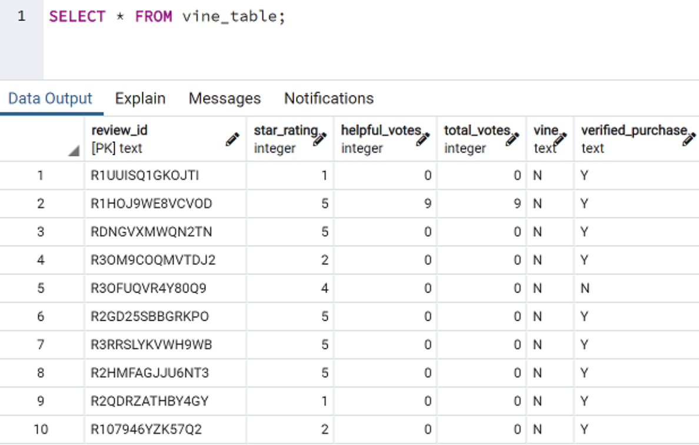

# Amazon_Vine_Analysis

Paid Vine Program written reviews analysis

# Overview

In using a cleaned data set, I was able to analyze the effects of the Amazon Vine Program in relation to star ratings. The Amazon Vine program allows publishers to retrieve reviews for their products. SellBy company, pays a small fee to Amazon and provide products to Amazon Vine members, who then are required to publish a review. 

# Results

• Non-vine reviews account for 46.3% of all 5-star reviews while paid reviews accounts for 57.1%.

• Vine and Non-vine reviewer 5-star ratings total 44,751.

• The data set I analyzed was (Home reviews) there are a total of 92,216 Vine and Non-vine reviewers.

• Percentage of paid ratings is 0.7% while percentage of unpaid ratings is 47.8%.

• There are 647 Vine and 44,104 Non-vine 5-star ratings.

# Summary

Reviewers disproportionately give 5-star ratings (57.1% of vine reviewers are giving a 5-star rating as compared to 46.3% from Non-vine reviewers). A positive bias for reviews goes towards the Vine program. 
